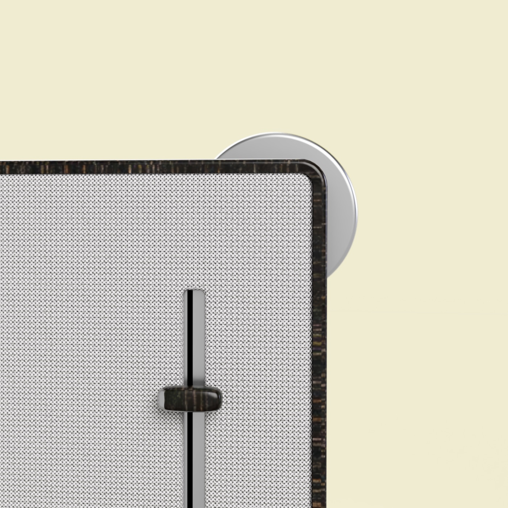

With recommendation systems like Spotify and Netflix, we get stuck in the bubble of top hits, where less popular songs or artists are forgotten in the digital world forever.    

 How might we empower musicians and listeners?
 
